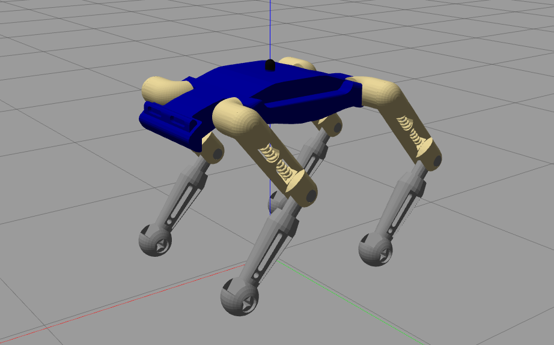
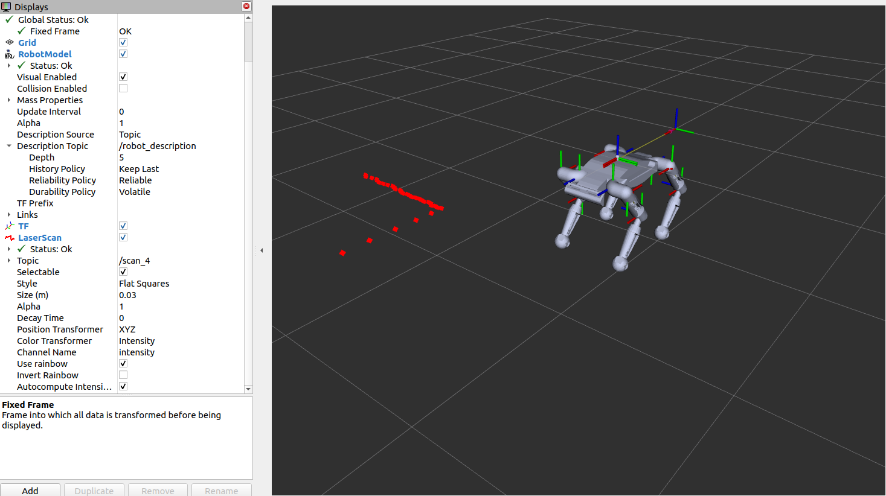

[](LICENSE)

# Bruno_Quadruped_Sim

## Introduction

This project aims to simulate a quadruped robot in Gazebo and control it with keyboard/Joypad commands using ROS2 Humble.

 

## Features

- [x] URDF model of a quadruped robot
- [x] ROS2 package for simulation and teleoperation
- [x] Teleoperation node for Virtual Joypad Control
- [ ] Teleoperation node for keyboard control
- [x] Launch files for Gazebo simulation and teleoperation :tada:


## Dependencies

- OS: Ubuntu Linux 22.04 Jammy Jellyfish
- ROS Version: ROS2 Humble
- Python3

## Instruction to run the simulation

Follow the steps below to setup the repository:

```bash
# source ROS2 and Build the workspace
source /opt/ros/galactic/setup.bash
# Create a workspace
mkdir -p ~/bruno_ws/src
cd bruno_ws/src
# Clone the repository in the workspace
git clone https://github.com/MayankD409/Bruno_Quadruped_Sim.git
# Install the dependencies
cd ~/bruno_ws
rosdep install -i --from-path src --rosdistro humble -y
# build the workspace
colcon build --symlink-install
```
To run the simulation open the terminal and follow the below steps:

```bash
# source ROS2
source /opt/ros/galactic/setup.bash
# Source the workspace
cd ~/bruno_ws
source install/setup.bash
# Run the launch file
ros2 launch bruno debug.launch.py
```
Open another terminal to launch the virtual Joypad Node for teleoperation:

```bash
# source ROS2
source /opt/ros/galactic/setup.bash
# Launch the Joypad
cd ~/bruno_ws/src/UI
python3 controller.py
```

## License

This project is licensed under the MIT License - see the LICENSE file for details.


